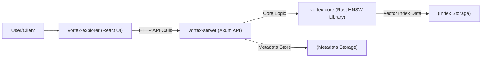

<div align="center">

## Vortex 🌀 Vector Similarity Search Engine & Explorer

</div>

*A high-performance, Rust-based 🦀 engine with an integrated React UI for building, managing, and visualizing vector similarity search applications.*

## Overview

Vortex is a comprehensive system for efficient vector similarity search and interactive data exploration, comprising:

- **`vortex-core`**: Rust library implementing HNSW algorithm for fast ANN search
- **`vortex-server`**: RESTful API server built with Axum/Tokio
- **`vortex-explorer`**: React-based web interface for visualization and management

Vortex is well-suited for applications such as Retrieval-Augmented Generation (RAG), semantic search, recommendation systems, and general-purpose vector data analysis and exploration.

## Key Features

### Core Library
- Pure Rust HNSW implementation with multiple distance metrics
- Configurable indexing parameters
- Index persistence with save/load capabilities

### API Server
- Asynchronous REST API with Axum and Tokio
- Multi-index management
- JSON metadata support

### Web Interface
- Interactive UI with React and Material UI
- Comprehensive index and vector management
- 2D visualization with UMAP and interactive exploration

## Architecture

Vortex follows a three-component architecture: `vortex-core` provides the foundational indexing and search logic, `vortex-server` exposes this logic via a REST API, and `vortex-explorer` offers a web-based graphical interface for users to interact with the system.


The `vortex-core` library is responsible for the HNSW graph operations and vector storage. The `vortex-server` handles API requests, manages index instances (each an instance of `vortex-core`'s `HnswIndex`), and maintains a separate store for JSON metadata associated with vectors. The `vortex-explorer` communicates with the `vortex-server` to perform all operations and render data.

## Project Status

**Current Stage: Alpha - Actively Developed**

Vortex is currently in an alpha stage of development. The core functionalities for vector indexing, search, metadata management, and UI interaction are implemented. However, the project is still undergoing active development, testing, and refinement.

## Installation & Setup

Follow these steps to get Vortex up and running on your local machine.

### Prerequisites
- **Rust** via [rustup](https://rustup.rs/)
- **Node.js and npm** via [nodejs.org](https://nodejs.org/)

### 1. Clone the Repository
```bash
git clone git@github.com:kanusowi/vortex.git
cd vortex
```

### 2. Run the Backend (`vortex-server`)
The backend server exposes the API for managing and searching vector indices.

```bash
# Build the server in release mode for optimal performance
cargo build --release -p vortex-server

# Run the server
# You can set the RUST_LOG environment variable to control log verbosity
# (e.g., vortex_server=debug,vortex_core=trace)
RUST_LOG=info cargo run --release -p vortex-server
```
By default, the `vortex-server` will start on `http://127.0.0.1:3000`.

### 3. Run the Frontend (`vortex-explorer`)
The frontend provides the web interface to interact with the Vortex server.

```bash
# Install dependencies
npm install

# Start the development server
npm run dev
```
Access the UI at `http://localhost:5173`

## API Reference (`vortex-server`)

The `vortex-server` exposes the following RESTful API endpoints.

| Method | Path                                 | Description                                                                 |
|--------|--------------------------------------|-----------------------------------------------------------------------------|
| `GET`  | `/indices`                           | Lists the names of all available indices.                                   |
| `POST` | `/indices`                           | Creates a new vector index.                                                 |
| `GET`  | `/indices/:name/stats`               | Retrieves statistics for the specified index (`:name`).                     |
| `PUT`  | `/indices/:name/vectors`             | Adds a new vector or updates an existing vector in the specified index.     |
| `GET`  | `/indices/:name/vectors`             | Lists vectors from the specified index. Supports `limit` query parameter.   |
| `GET`  | `/indices/:name/vectors/:vector_id`  | Retrieves a specific vector by its ID (`:vector_id`) from the index.        |
| `DELETE`| `/indices/:name/vectors/:vector_id` | Deletes a specific vector by its ID from the index (soft delete).           |
| `POST` | `/indices/:name/search`              | Performs a k-NN search for similar vectors within the specified index.      |

---

**Example API Interactions:**

**1. Create an Index**
*   **Method:** `POST`
*   **Path:** `/indices`
*   **Request Body:**
    ```json
    {
      "name": "my_document_embeddings",
      "dimensions": 768,
      "metric": "Cosine",
      "config": {
        "m": 16,
        "m_max0": 32,
        "ef_construction": 200,
        "ef_search": 50,
        "ml": 0.36067,
        "seed": null
      }
    }
    ```
*   **Success Response (201 Created):**
    ```json
    {
      "message": "Index 'my_document_embeddings' created successfully"
    }
    ```

**2. Add/Update a Vector (with Metadata)**
*   **Method:** `PUT`
*   **Path:** `/indices/:name/vectors`
*   **Request Body:**
    ```json
    {
      "id": "doc_001",
      "vector": [0.1, 0.2, .... , 0.9],
      "metadata": {
        "source_file": "chapter1.txt",
        "page_number": 5
      }
    }
    ```
    *(The `metadata` field is optional and accepts any valid JSON object.)*
*   **Success Response (201 Created or 200 OK):**
    ```json
    {
      "message": "Vector 'doc_001' processed successfully"
    }
    ```

**3. Search for Similar Vectors**
*   **Method:** `POST`
*   **Path:** `/indices/:name/search`
*   **Request Body:**
    ```json
    {
      "query_vector": [0.15, 0.25, .... ,0.85],
      "k": 5
    }
    ```
*   **Success Response (200 OK):**
    ```json
    {
      "results": [
        {
          "id": "doc_001",
          "score": 0.987,
          "metadata": { "source_file": "chapter1.txt", "page_number": 5 }
        }
        // other results
      ]
    }
    ```
    *(Search results include the `metadata` associated with each vector.)*

*(Note: For detailed request/response models, including all fields for statistics and vector listings, refer to `vortex-server/src/models.rs`.)*

## `vortex-core` Library Usage

For developers wishing to use the HNSW indexing and search capabilities directly within their Rust applications, `vortex-core` can be used as a library.

**1. Add to your `Cargo.toml`:**
```toml
[dependencies]
vortex-core = { path = "../vortex-core" } # Adjust path if used outside the monorepo
# or if published:
# vortex-core = "0.1.0" # Replace with actual version
tokio = { version = "1", features = ["macros", "rt-multi-thread"] } # For async main
```

**2. Example Usage:**
```rust
use vortex_core::{HnswIndex, Index, HnswConfig, DistanceMetric, Embedding, VectorId, VortexResult};

#[tokio::main]
async fn main() -> VortexResult<()> {
    // 1. Define HNSW configuration
    let config = HnswConfig::new(16, 200, 50, 1.0 / (16.0f64.ln()));
    let dimensions = 128;

    // 2. Create a new index instance
    let mut index = HnswIndex::new(config, DistanceMetric::Cosine, dimensions)?;

    // 3. Add vectors
    index.add_vector("doc_1".to_string(), vec![0.1; dimensions].into()).await?;
    index.add_vector("doc_2".to_string(), vec![0.2; dimensions].into()).await?;

    // 4. Search for similar vectors
    let query_vector: Embedding = vec![0.15; dimensions].into();
    let search_results = index.search(query_vector, 1).await?;
    for (id, score) in search_results {
        println!("Found: ID: {}, Score: {:.4}", id, score);
    }
    Ok(())
}
```
*(Refer to `vortex-core/src/index.rs` and its tests for more detailed examples of using the `Index` trait methods like `get_vector`, `delete_vector`, `save`, `load_from_path`, etc.)*

## Testing

To run the complete test suite for all crates in the workspace:
```bash
cargo test --all
```

## Contributing

Contributions to Vortex are welcome! Please feel free to:
*   Open an issue on the GitHub repository for bugs or feature requests.
*   Fork the repository and submit a pull request for your contributions.

## License

Vortex is licensed under the Apache License 2.0
